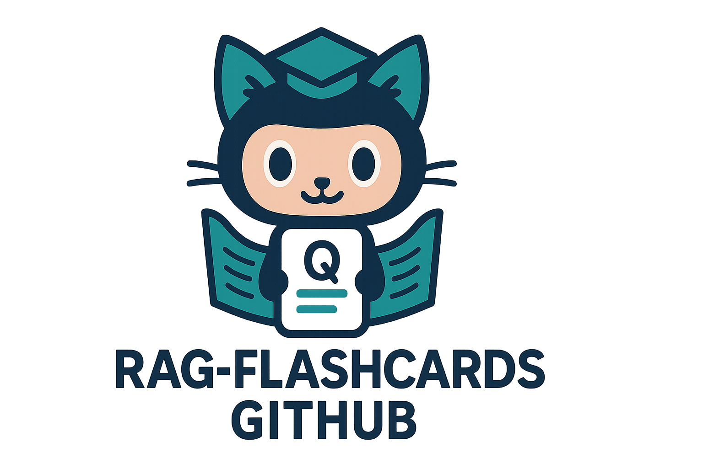
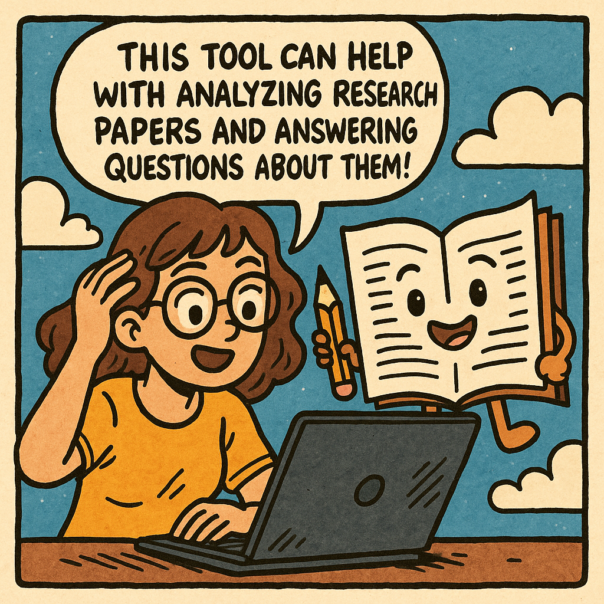

<!-- Logo -->
<p align="center">
  
</p>

# Personal Knowledge Base & Learning Assistant

[中文版说明请见 README.zh.md](README.zh.md)

---

## About This Project

<p align="center">
  
</p>

Hello! This is my very first programming project. Although I am not a computer science major, I am passionate about learning new technologies and wanted to challenge myself by building something practical and interesting. Through this project, I hope to demonstrate my ability to learn independently, apply various tools, and solve real-world problems. I am still learning, and any feedback or suggestions are very welcome!

---


## Tech Stack & What I Learned

This project is a hands-on journey for me to explore and integrate the following technologies:

- **Python**: Main programming language for backend logic and data processing.
- **Streamlit**: Rapidly building interactive web apps for data science and ML.
- **OpenAI API**: Using large language models for text generation, summarization, and Q&A.
- **ChromaDB**: Vector database for semantic search and retrieval-augmented generation (RAG).
- **LangChain**: Framework for chaining LLMs and document loaders.
- **PyMuPDF, Unstructured, etc.**: Document parsing and chunking.
- **Anki Export**: Automated generation of flashcards for spaced repetition.
- **Docker & Git**: Basic experience with containerization and version control.

I learned a lot about API integration, prompt engineering, and how to connect different Python libraries to create a full-stack application. I am still improving my code style and best practices.

---

## Features

- **Document Ingestion**: Upload and process PDFs, Word, Excel, Markdown, and HTML files.
- **Flexible Chunking**: Split documents by sentence, paragraph, page, or fixed length for downstream tasks.
- **Semantic Search (RAG)**: Retrieve relevant document chunks using vector embeddings and similarity search.
- **Literature Review & Q&A**: Ask research questions and get summarized answers with citations.
- **Anki Card Generation**: Automatically create Q&A and cloze flashcards from your knowledge base.
- **Interactive Dashboard**: Visualize project status, chunk/embedding counts, and processing progress.
- **Customizable Templates**: Edit summarization and card generation prompts to fit your needs.
- **Multi-language UI**: Supports both English and Chinese interfaces.

---

## Project Progress

| Milestone                   | Status         | Notes                            |
| --------------------------- | -------------- | -------------------------------- |
| Initial Project Setup       | ✅ Completed    | Streamlit skeleton created       |
| PDF Ingestion & Chunking    | ✅ Completed    | Supports multiple chunk methods  |
| Vector Database Integration | ✅ Completed    | Chroma DB integration            |
| Retrieval QA Module         | 🔄 In Progress | Streaming Chat UX refinement     |
| Anki Card Export            | 🔄 In Progress | Q\&A and cloze formats supported |
| Dashboard & Metrics         | 🔲 Pending     | Design visualization components  |
| Wish List Integration       | 🔲 Pending     | Add wishlist management UI       |

---

## Roadmap & Future Plans

- [ ] Improve UI/UX and add more visualizations to the dashboard.
- [ ] Add support for more document types and languages.
- [ ] Enhance citation and bibliography export features.
- [ ] Mobile-friendly interface or companion app.
- [ ] Cloud sync and multi-device support.
- [ ] More advanced analytics for learning progress.
- [ ] Refactor code for better modularity and maintainability.

---

## Project Structure

```
anki_llm_withqa/
├── app.py               # Streamlit app entry point
├── anki/                # Flashcard generation logic
├── embed/               # Embedding and vector DB logic
├── preprocess/          # Document loading and chunking
├── retrieve/            # Semantic search and RAG
├── dashboard/           # UI components and metrics
├── data/                # Raw and processed files
├── requirements.txt     # Python dependencies
├── README.md            # Project overview (this file)
└── LICENSE
```

---

## How to Run

1. **Clone the repository:**
   ```bash
   git clone https://github.com/mag233/rag-anki-kit.git
   cd rag-anki-kit
   ```

2. **Install dependencies:**
   ```bash
   pip install -r requirements.txt
   ```

3. **Set your OpenAI API key:**
   ```bash
   export OPENAI_API_KEY="your_api_key"
   ```

4. **Start the app:**
   ```bash
   streamlit run app.py
   ```

---

## Usage

- Go to the **RAG** tab to upload and process your documents.
- Use the **Literature Review** tab to ask questions and get summaries.
- Generate and export flashcards in the **Anki Cards** tab.

---

## Contributing

I am still learning and open to all suggestions! If you have ideas or want to help, feel free to:

1. Fork this repo.
2. Create a new branch (`git checkout -b feature/your-feature`).
3. Commit your changes.
4. Open a Pull Request.

---

## License

This project is licensed under the [MIT License](LICENSE).

---

Thank you for checking out my project! If you have any advice or want to connect, please reach out via GitHub.
